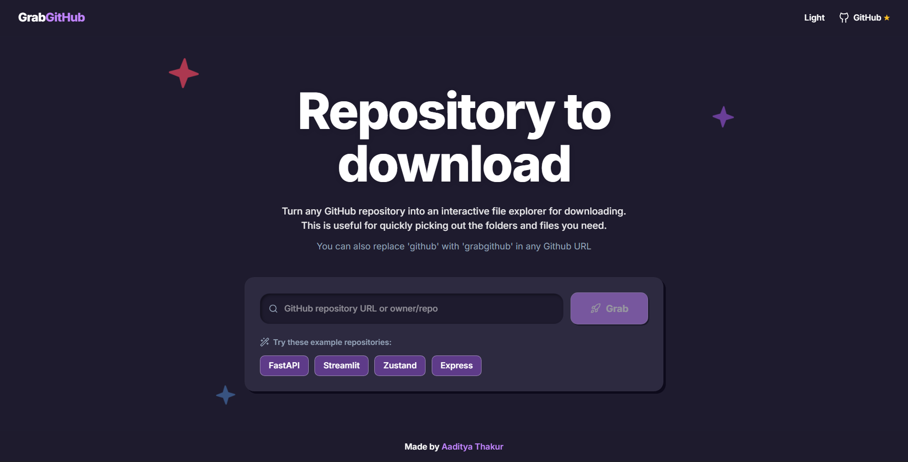

<div align="center">
  

  <br />

  # 🚀 Grab GitHub

  **Download specific files and folders from any GitHub repository — no cloning required.**

  [](https://react.dev/)
  [](https://www.typescriptlang.org/)
  [](https://tailwindcss.com/)
  [](https://vitejs.dev/)
  [](https://expressjs.com/)

</div>

<hr />

**Grab GitHub** is a premium web application that turns any public GitHub repository into a selectable, interactive file explorer. Paste a URL, browse the tree, select exactly what you need, and download it as a neat ZIP archive.

## ✨ Features

- 🔗 **Paste Any GitHub URL** — Supports full repos, specific branches, subfolders, or even a single file path.
- 🌳 **Interactive File Tree** — Fully expandable, searchable file browser with rich file-type icons.
- ☑️ **Smart Selection** — Tri-state checkboxes with automatic folder propagation. Select what you need, skip what you don't.
- 📦 **Instant ZIP Downloads** — Server-side streaming architecture provides real-time progress feedback without memory bloat.
- ⚡ **Blazing Fast** — Powered by the GitHub Trees API (one call for the entire tree) combined with intelligent server-side caching.
- 🎨 **Premium Aesthetic UI** — Beautiful, playful neumorphic design enhanced with fluid animations and delightful micro-interactions.
- 🔍 **SEO Optimised** — Fully equipped with meta tags, Open Graph, Twitter Cards, and JSON-LD schema for top-tier discoverability.

## 🛠️ Tech Stack

Our stack is carefully chosen for performance, developer experience, and scalability.

| Layer | Technology | Description |
| :--- | :--- | :--- |
| **Frontend** | React 19, TypeScript, Tailwind CSS v4 | Cutting-edge UI rendering with strong typing and utility-first styling. |
| **State Management** | Zustand | Fast, scalable, and minimalistic state management. |
| **Backend** | Express 4 (Node.js) | Lightweight, robust server handling API proxies and streaming. |
| **Build Tool** | Vite 6 + esbuild | Next-generation frontend tooling for ultra-fast builds. |
| **Icons** | lucide-react | Beautiful, consistent open-source icons. |
| **Compression** | archiver | Efficient server-side ZIP streaming. |

## 🚀 Setup & Installation

### Prerequisites
Make sure you have **Node.js ≥ 18** installed on your machine.

### 1. Install & Run Locally

```bash
# Clone the repository (or download via Grab GitHub!)
git clone https://github.com/aditya452007/GrabGithub.git
cd GrabGithub

# Install dependencies
npm install

# Start the development server
npm run dev
```

The application will be running at `http://localhost:3000`.

### 2. Environment Variables

To avoid strict API rate limits, copy `.env.example` to `.env.local` and configure your GitHub token:

```env
# Highly recommended — increases GitHub API rate limit from 60 to 5,000 requests/hour
# Generate at: https://github.com/settings/tokens (no scopes needed for public repos)
GITHUB_TOKEN=your_github_personal_access_token
```

### 3. Build for Production

To create a production-ready build:

```bash
npm run build
npm start
```

## 📁 Project Structure

Here's a brief overview of how the codebase is organized:

```text
GrabGithub/
├── server.ts            # Express server, GitHub API proxy, and ZIP streaming logic
├── index.html           # SPA entry point with SEO metadata
├── public/              # Static assets (robots.txt, sitemap, hero images, etc.)
│   └── assets/
│       └── hero.png
└── src/                 # Application Source Code
    ├── App.tsx          # Main application UI and layout
    ├── store.ts         # Zustand global state management
    ├── index.css        # Global styles, neumorphic tokens, and animations
    ├── main.tsx         # React root entry
    ├── lib/             # Utility functions
    │   └── utils.ts     # ClassName/clsx helpers
    └── components/      # Reusable UI Components
        ├── TreeBrowser.tsx   # File tree with search and icons
        ├── DownloadPanel.tsx # Download bar with size estimation
        ├── Breadcrumb.tsx    # Navigation breadcrumbs
        ├── Toast.tsx         # Toast notification system
        ├── SkeletonTree.tsx  # Loading placeholders
        └── ErrorBoundary.tsx # Global error fallback
```

## 🌐 Deployment

Since Grab GitHub utilizes an Express backend for its advanced server-side streaming capabilities, it requires a **Node.js runtime** and cannot be deployed as a simple static site.

**Recommended hosting platforms:**
- [Railway](https://railway.app) — Easiest setup, automatic Node.js detection.
- [Render](https://render.com) — Great free tier availability.
- [Fly.io](https://fly.io) — Excellent for global edge deployments.
- [Vercel](https://vercel.com) — Supported with custom server configuration.

---

<div align="center">

**Made by developer, made for developers.**

Created with ❤️ by [Aaditya Thakur](https://github.com/aditya452007)

</div>
